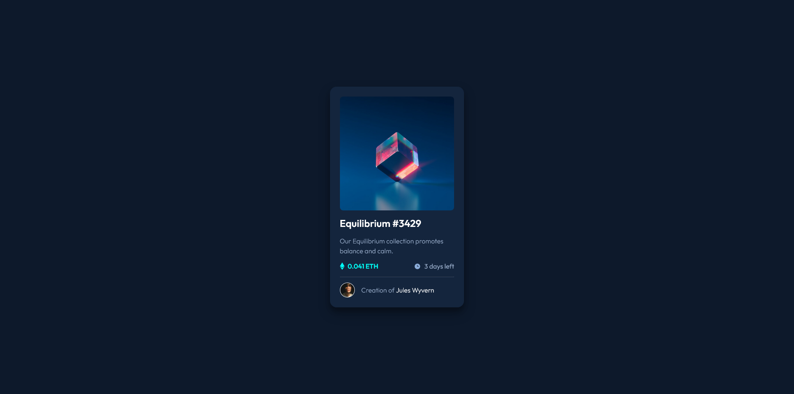

# Frontend Mentor - NFT preview card component solution

This is a solution to the [NFT preview card component challenge on Frontend Mentor](https://www.frontendmentor.io/challenges/nft-preview-card-component-SbdUL_w0U). 

## Table of contents

- [Overview](#overview)
  - [The challenge](#the-challenge)
  - [Screenshot](#screenshot)
  - [Links](#links)
- [My process](#my-process)
  - [Built with](#built-with)
  - [What I learned](#what-i-learned)
  - [Difficulties](#difficulties)
  - [Useful resources](#useful-resources)
- [Author](#author)
- [Acknowledgments](#acknowledgments)

## Overview

### The challenge

Users should be able to:

- View the optimal layout depending on their device's screen size
- See hover states for interactive elements

### Screenshot

### Links

- Live Site URL: [NFT Preview Card Component By Earthyy](https://earthyy-nft-preview-card-component.netlify.app/)

## My process

### Built with

- Semantic HTML5 markup (Probably)
- CSS custom properties
- Flexbox
- CSS Grid
- Mobile-first workflow
- [CSS Scan](https://getcssscan.com/css-box-shadow-examples) - For Box Shadows

### What I learned

I used for the first time BEM approach for naming classes. Organizing the stylesheet file and using Semantic HTML markups make the project more appealing for the reader. Furthermore, it makes developing websites faster and easier

### Difficulties
* Box shadows are hard to determine without the figma file, so I chose some random box shadows that fit the design

* I tried adding svg icons with ::before pseudo element, but it didn't work. I figured out later that I can use inline-flex in the main component to align both elements properly

### Useful resources

- [Kevin Powell](https://www.youtube.com/@KevinPowell) - My favorite channel for learning CSS.
- [BEM](https://getbem.com/naming/) - A cool naming convention for HTML 
- [Web Design Tools](https://niemvuilaptrinh.medium.com/top-87-web-design-tools-for-developer-816e52e3a521) - 87 Web Design Tools For Developers by [Niemvuilaptrinh](https://niemvuilaptrinh.medium.com/)

## Author

- Frontend Mentor - [@Earthyyy](https://www.frontendmentor.io/profile/Earthyyy)
- Github - [@Earthyy](https://github.com/Earthyyy)

## Acknowledgments

Big Thanks <3 to :

* [Kevin Powell](https://www.youtube.com/@KevinPowell)
* [Codecademy](https://www.codecademy.com)
* [Frontend Mentor](https://www.frontendmentor.io/) 

